# Azure Cloud Security Baseline — Key Vault, Private Endpoints & Policy-as-Code


An Azure security baseline provisioned with Terraform and deployed through a GitHub Actions pipeline that authenticates to Azure with **OIDC federated credentials** — no long-lived secrets. The environment enforces the **CIS Azure Foundations Benchmark** with policy-as-code, keeps a secret in **Key Vault reachable only over a Private Endpoint**, and demonstrates **least-privilege RBAC** with a custom role. **Microsoft Defender for Cloud** measures posture throughout.

> The infrastructure (Part 2) is deployed by the pipeline: validated on every pull request, applied automatically on merge to `main`. The policy assignment, custom role, and reviews (Parts 1, 4–6) are portal/CLI steps documented below.

---

## Table of Contents

- [Architecture](#architecture)
- [Security Controls](#security-controls)
- [Tech Stack](#tech-stack)
- [Repository Structure](#repository-structure)
- [CI/CD Pipeline](#cicd-pipeline)
- [Prerequisites](#prerequisites)
- [One-Time Setup](#one-time-setup)
- [How to Deploy](#how-to-deploy)
- [Walkthrough](#walkthrough)
  - [1. Defender for Cloud & CIS Policy](#1-defender-for-cloud--cis-policy)
  - [2. Key Vault + Private Endpoint](#2-key-vault--private-endpoint)
  - [3. Verifying the Private Endpoint](#3-verifying-the-private-endpoint)
  - [4. Custom RBAC Role](#4-custom-rbac-role)
  - [5. Defender Recommendations](#5-defender-recommendations)
  - [6. KQL Security Queries (Remediate & Verify)](#6-kql-security-queries-remediate--verify)
- [Skills Demonstrated](#skills-demonstrated)
- [Notes & Hardening Ideas](#notes--hardening-ideas)
- [Teardown](#teardown)

---

## Architecture

The design isolates the secret store from the public internet entirely. Key Vault has `public_network_access_enabled = false`; the only path to it is a Private Endpoint that lands a private IP inside the VNet, and a Private DNS Zone rewrites the vault's public hostname to that private IP so clients resolve it transparently.

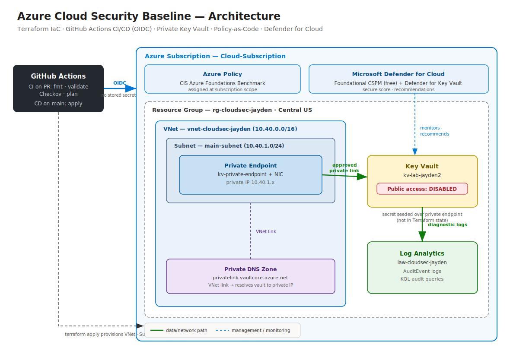

```

---

## Security Controls

| Control | Implementation | Why it matters |
| --- | --- | --- |
| **CSPM** | Microsoft Defender for Cloud (free tier) | Continuous secure-score and prioritized recommendations |
| **Policy-as-code** | CIS Azure Foundations Benchmark initiative at subscription scope | Auditable, enforced baseline instead of manual checklists |
| **Network isolation** | Key Vault Private Endpoint + public access disabled | Vault is unreachable from the internet |
| **Private name resolution** | Private DNS Zone `privatelink.vaultcore.azure.net` | In-VNet clients resolve the vault to a private IP |
| **Secrets management** | Secret stored in Key Vault, seeded over the private path | No plaintext connection strings in app config |
| **Least privilege** | Custom RBAC role scoped to a single secret | Narrower than the built-in *Key Vault Secrets User* role |
| **Pipeline identity** | OIDC federated credentials | No client secrets stored in GitHub |

---

## Tech Stack

- **IaC:** Terraform (`azurerm` provider)
- **CI/CD:** GitHub Actions with OpenID Connect federation
- **Security scanning:** Checkov (Terraform static analysis)
- **Cloud:** Azure — Key Vault, Private Endpoint, Private DNS, VNet, Defender for Cloud, Azure Policy, RBAC
- **State:** Azure Storage remote backend

---

## CI/CD Pipeline

The workflow (`.github/workflows/terraform.yml`) has two jobs driven entirely by which event fired:

| Event | Jobs that run | What happens |
| --- | --- | --- |
| **Pull request → `main`** | `ci` only | `fmt` → `init` → `validate` → Checkov scan → `plan`. The plan is posted as a PR comment. **Nothing is applied.** |
| **Push → `main`** (merge) | `ci`, then `cd` | CI re-runs, then Terraform **applies** to Azure. |

The deploy job is gated so it can *only* run on a direct push to `main`:

```yaml
cd:
  needs: ci
  if: github.event_name == 'push' && github.ref == 'refs/heads/main'
```

**Why authentication needs two federated credentials.** The OIDC `subject` claim GitHub sends differs between the two triggers, so Azure needs a matching federated credential for each:

| Trigger | OIDC subject claim | Federated credential |
| --- | --- | --- |
| Push to `main` | `repo:jaydendh/Azure-Cloud-Security-Baseline:ref:refs/heads/main` | `gh-main` |
| Pull request | `repo:jaydendh/Azure-Cloud-Security-Baseline:pull_request` | `gh-pr` |

Both are created by `scripts/setup-oidc.sh`. Miss one and that half of the pipeline fails to authenticate.

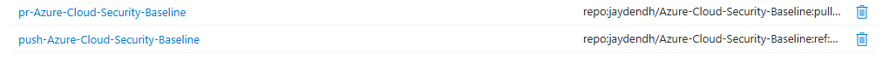

> **Workflow note:** CI runs on pull requests to `main`. To get a CI run on a feature branch, open a PR against `main`. To also fire CI on every direct push to a feature branch, add those branches under `on.push.branches`.

---

## Prerequisites

- Active Azure subscription with **Contributor** at subscription scope (needed to assign the policy)
- Azure CLI (`az login`) and Terraform ≥ 1.9 installed locally
- A GitHub repository for this code

---

## One-Time Setup

Run these **once**, locally, before the first pipeline run.

**1. Create the remote-state storage account:**

Copy the printed storage account name into `backend.tf` (`storage_account_name`).

**2. Create the OIDC identity and federated credentials:**

```bash
# edit GH_OWNER / GH_REPO at the top of the script first
./scripts/setup-oidc.sh
```

**3. Add the three secrets it prints to your GitHub repo** under
*Settings → Secrets and variables → Actions*: `AZURE_CLIENT_ID`, `AZURE_TENANT_ID`, `AZURE_SUBSCRIPTION_ID`.

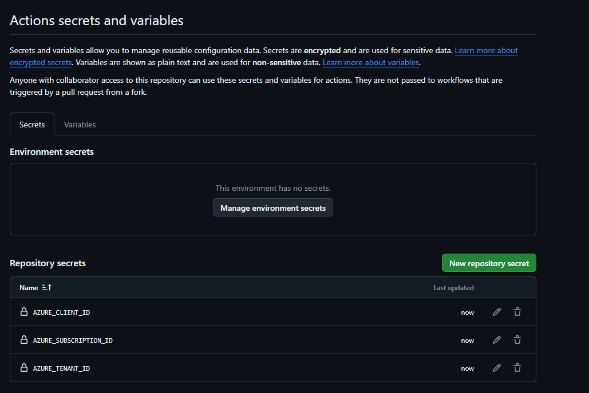

---

## How to Deploy

The whole point is that you don't run `terraform apply` by hand.

```bash
git checkout -b feature/my-change
# ...make changes...
git push origin feature/my-change
# open a PR against main  ->  CI runs, plan posted as a comment
```

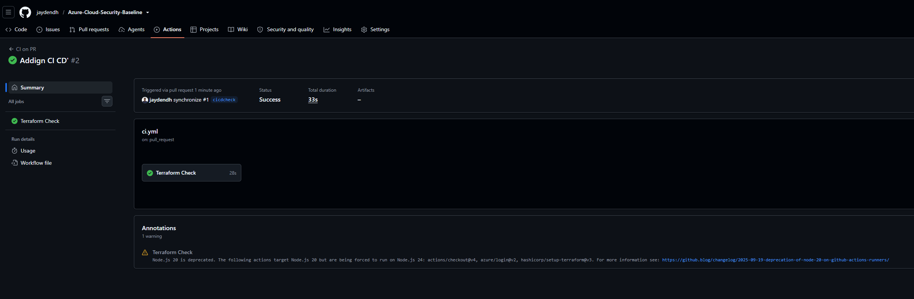

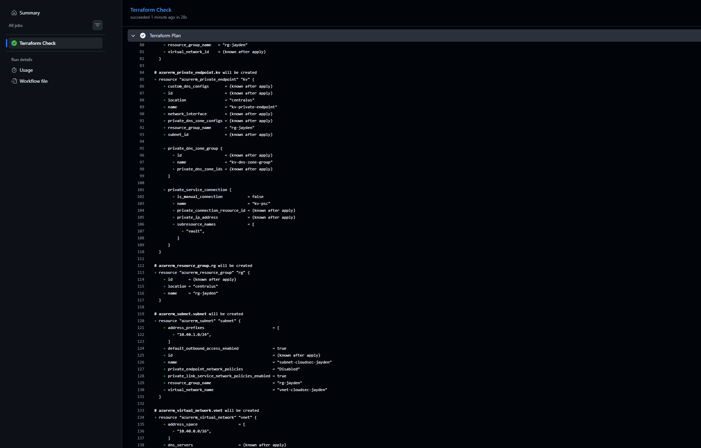

Merge the PR. The push to `main` triggers the deploy:

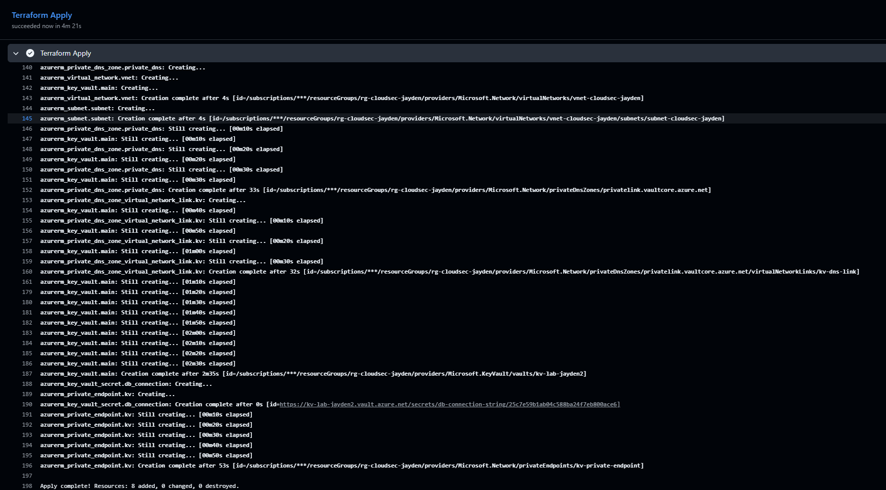
---

## Walkthrough

### 1. Defender for Cloud & CIS Policy

Defender for Cloud's free tier (foundational CSPM) is on by default and provides the secure score. The **CIS Azure Foundations Benchmark** initiative is assigned at subscription scope, giving a compliance percentage you can drill into per control. Assign it in the portal (**Policy → Definitions →** filter to *Initiative* **→** find CIS **→ Assign →** scope to your subscription **→ Review + create**) or via CLI. Compliance evaluation takes ~15–30 minutes.

> Note: the compliance percentage reflects only the mapped policy definitions — some CIS controls have no automated Azure Policy mapping, so 100% here is not the same as full CIS compliance.


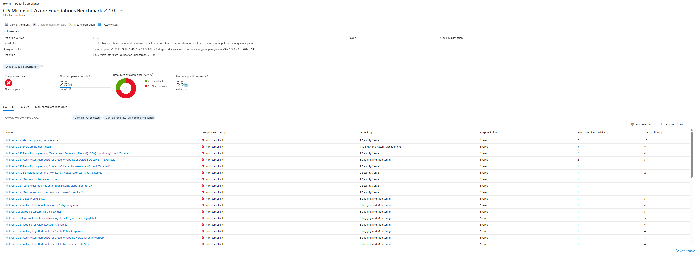

### 2. Key Vault + Private Endpoint

Terraform provisions the VNet, subnet, Key Vault (public access **disabled**), the Private DNS Zone, its VNet link, and the Private Endpoint. On merge to `main`, the pipeline applies all of it.

> **Seeding the secret:** because public access is disabled, the vault only accepts data-plane calls over the private endpoint. The secret is therefore **not** created by Terraform (that call would come from outside the VNet and be rejected). Seed it once from inside the VNet — e.g. from the VM in Part 3 — with `az keyvault secret set`. This also keeps the secret value out of Terraform state.

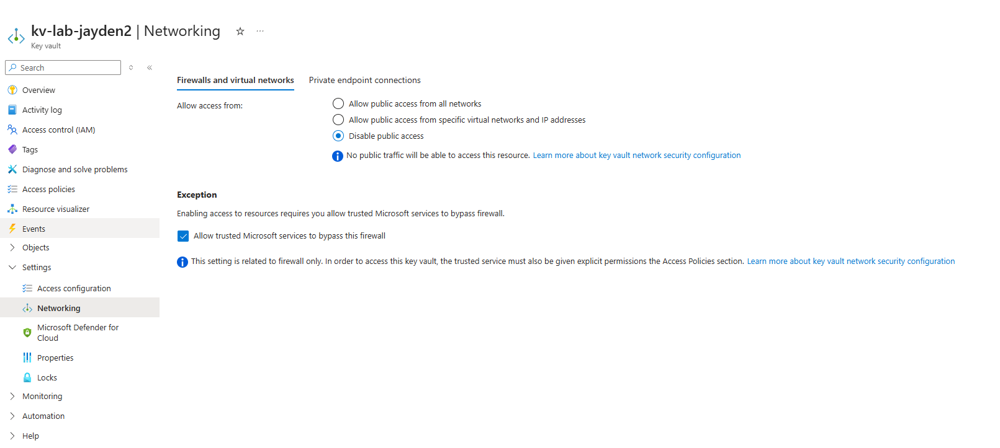

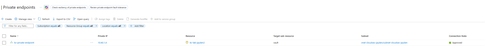

### 3. Verifying the Private Endpoint

The control is only real if you prove it. From your local machine the vault should be **unreachable**; from inside the VNet it should resolve to a private IP and succeed.

```bash
# From your laptop — expected to FAIL (public access disabled)
az keyvault secret show --vault-name kv-lab-jayden --name db-connection-string

# From a VM inside the VNet — expected to SUCCEED
az keyvault secret show --vault-name kv-lab-jayden --name db-connection-string

# DNS should resolve to a private 10.40.x.x address
nslookup kv-lab-jayden.vault.azure.net
```

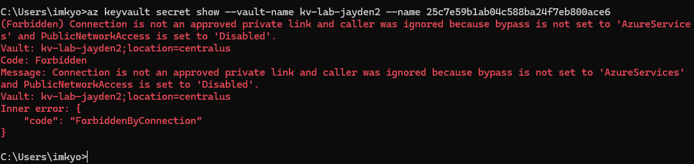

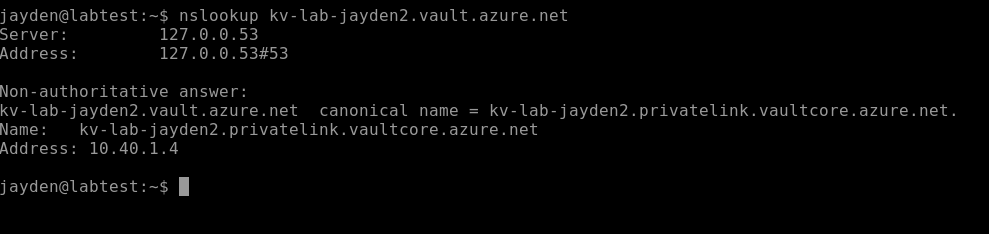

### 4. Custom RBAC Role

Instead of the broad built-in *Key Vault Secrets User* role, a custom role is created that grants exactly one data action — reading a single secret — demonstrating least privilege. This was built through the **Azure portal** rather than the CLI:

**Create the role** — resource group `rg-cloudsec-jayden` → **Access control (IAM)** → **+ Add** → **Add custom role**:
- **Name:** `Key Vault Secret Reader - DB Only`; baseline permissions *Start from scratch*.
- **Permissions** → **+ Add permissions** → **Microsoft Key Vault** → switch to the **Data actions** view → check **Get Secret** (`Microsoft.KeyVault/vaults/secrets/getSecret/action`). This is the key detail — secret read is a *data action*, not a regular action.
- **Assignable scopes** defaults to the resource group (the role's launch scope).
- **Review + create**. The *JSON* tab on this step shows the generated definition — equivalent to `custom-role.json` in this repo, kept for reference.

**Assign the role** — same resource group → **Access control (IAM)** → **+ Add** → **Add role assignment** → select the custom role → add your account as a member → **Review + assign**.

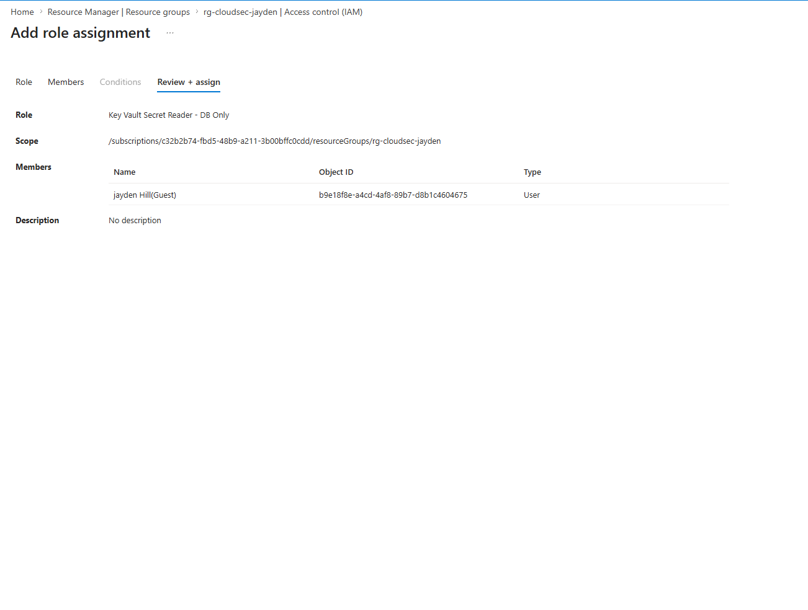

### 5. Defender Recommendations (Detect)

With Defender for Key Vault enabled, Defender for Cloud surfaces active recommendations scoped to the vault — including **"Diagnostic logs in Key Vault should be enabled,"** along with firewall, secret-expiration, deletion-protection, and *"RBAC should be used on Key Vault"* findings. The diagnostic-logging finding is the one remediated in Part 6; the RBAC finding corroborates the access-mode note under [Notes](#notes--hardening-ideas).


### 6. KQL Security Queries (Remediate & Verify)

**Remediate** the diagnostic-logging finding from Part 5: create a Log Analytics workspace, then on the Key Vault go to **Monitoring → Diagnostic settings → Add**, select the **AuditEvent** category, and send it to the workspace.

**Verify** by generating a few secret operations (`az keyvault secret set` / `show`) and then querying the audit log in Log Analytics:

```kusto
AzureDiagnostics
| where ResourceType == 'VAULTS'
| where OperationName == 'SecretGet'
| project TimeGenerated, CallerIPAddress, identity_claim_oid_g, ResultType, requestUri_s
| order by TimeGenerated desc
```

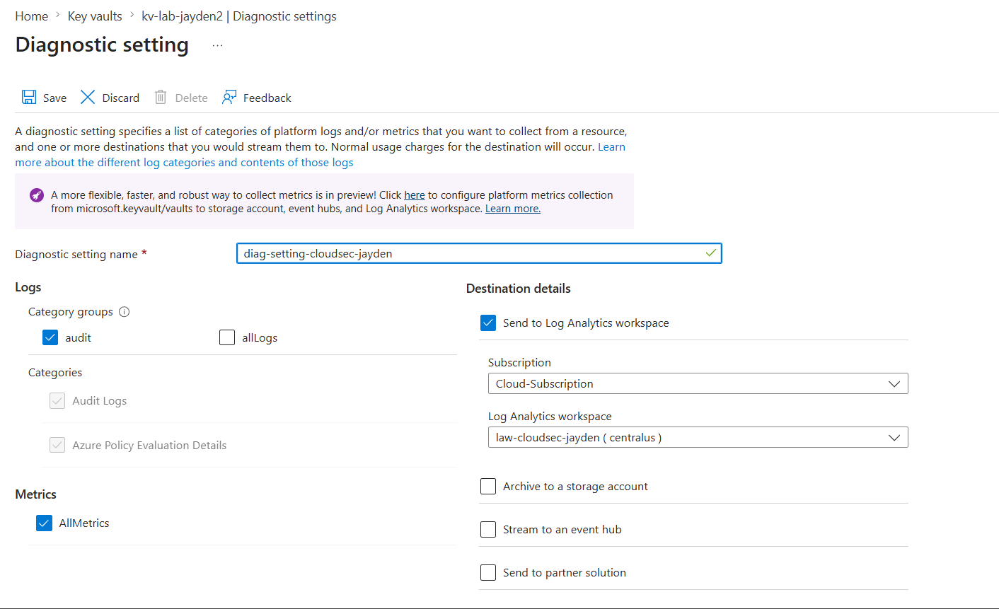

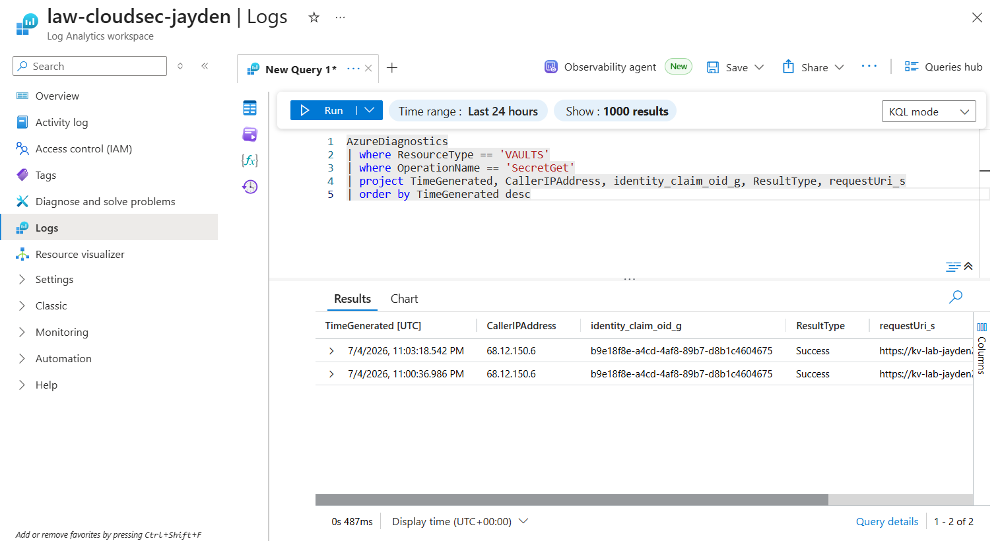

> Note: allow ~10–15 minutes after enabling the diagnostic setting for logs to start flowing before the query returns rows.

---

**Tips:** capture at a consistent width (~1600px), crop out unrelated portal chrome, and redact subscription / tenant / object IDs. The highest-value shots for a reviewer skimming quickly are **06 (CD apply)**, **09 (public access disabled)**, and **08 (CIS compliance)** — consider pulling a couple near the top.

---

## Skills Demonstrated

- **Platform engineering:** end-to-end GitHub Actions pipeline with branch-based promotion (CI on PR, CD on merge), remote state, and a deploy gate
- **Keyless auth:** OIDC federation between GitHub and Entra ID, including the push-vs-pull-request subject-claim distinction
- **Infrastructure as Code:** Terraform for VNet, Private Endpoint, Private DNS, and Key Vault
- **DevSecOps:** Checkov scanning in CI; policy-as-code with the CIS benchmark
- **Network security:** private-only service access and private DNS resolution
- **Identity & access:** custom RBAC role enforcing least privilege
- **Cloud security posture management:** Defender for Cloud secure score and remediation

---

## Notes & Hardening Ideas

- **Secret handling:** the secret is seeded over the private endpoint rather than committed to Terraform, so its value never lands in state. Generate it out-of-band (or with `random_password`) in a real environment.
- **Custom role scope:** the custom role grants a single `getSecret` data action. Note that for a data-plane role like this to govern access, the vault must be in Azure RBAC authorization mode; in the lab's access-policy mode it is demonstrative.
- **Make the scan a gate:** Checkov runs with `soft_fail: true` so findings are reported but don't block. Flip to `false` once findings are triaged.
- **Add a manual approval:** the `cd` job uses a `production` environment — add required reviewers under *Settings → Environments* to require a human click before deploy.

---

## Teardown

```bash
terraform destroy
```
